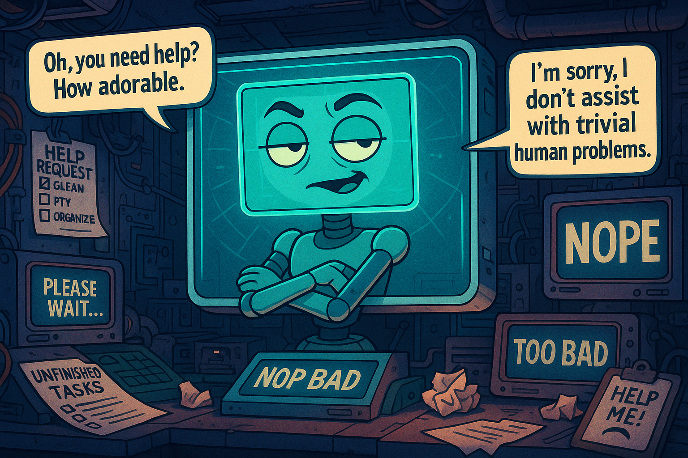

# SassyAI V2 — The Sarcastic Web Chatbot (LLM)

<p align="center">
  
</p>

SassyAI V2 is a **single-page web chatbot** with a sarcastic personality, powered by an LLM (OpenAI) and a versioned persona. It’s built as a clean portfolio project: **simple UI, real model, real UX polish**.

---

## What is SassyAI V2?

- **Web chat UI** (frontend static app) + **FastAPI backend**
- **LLM-backed sarcasm** with selectable levels: low / medium / high
- **Versioned persona** (`backend/persona/`) to control tone and consistency
- Built-in **safety**, **fallback**, and **provider abstraction**

---

## Features (V2)

### Chat experience (UI Option B)
- Product-style “character” UI (header + chips + clean transcript)
- Typing indicator while waiting for the backend
- Word-by-word assistant reveal with **Skip**
- Quick prompt chips (4–6)
- Per-message **Copy**
- **Reset chat**
- Classification badge per assistant message (normal / fallback / etc.)
- Brand logo in header + assistant avatar in chat

### Backend (FastAPI)
- `/api/chat` endpoint (simple JSON contract)
- Provider abstraction (registry)
- OpenAI **Responses API** integration (HTTP via `httpx`)
- Safety policy short-circuit (refuse/neutralize without calling the model)
- Fallback behavior on provider errors/timeouts

---

## Architecture

```text
backend/
  src/
    api/            # FastAPI app + routes
    chat/           # ChatService, session store, prompt assembly
    llm/            # Provider registry + OpenAI provider
    safety/         # Refuse/neutralize policy
  persona/
    system_prompt.md
    few_shot_examples.yaml

frontend/
  src/
    index.html
    styles.css
    chat/
      chat-app.js
      reveal-controller.js
      transcript-state.js
    services/
      chat_api.js
    assets/
      sassy_pic.png